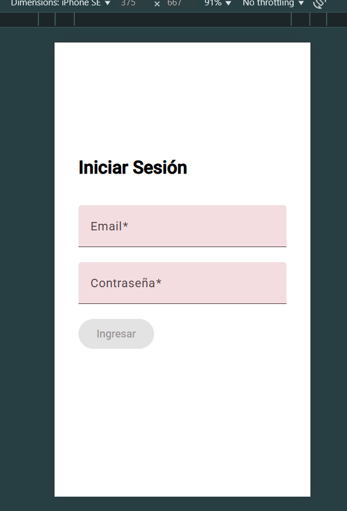
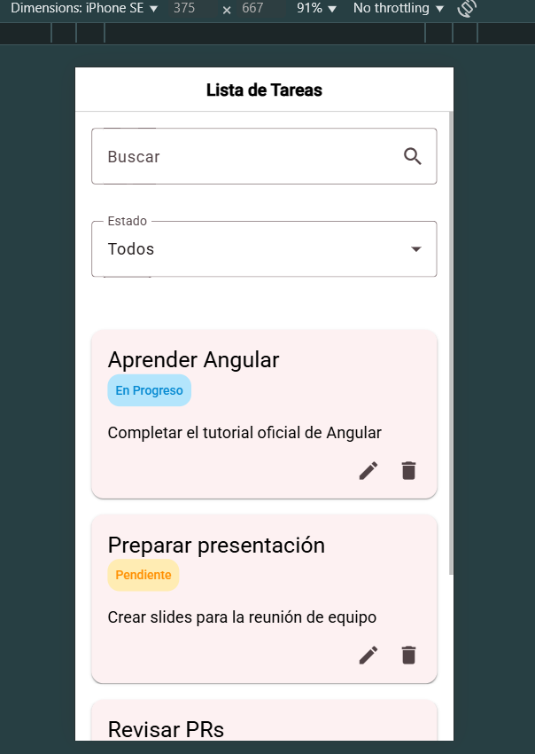
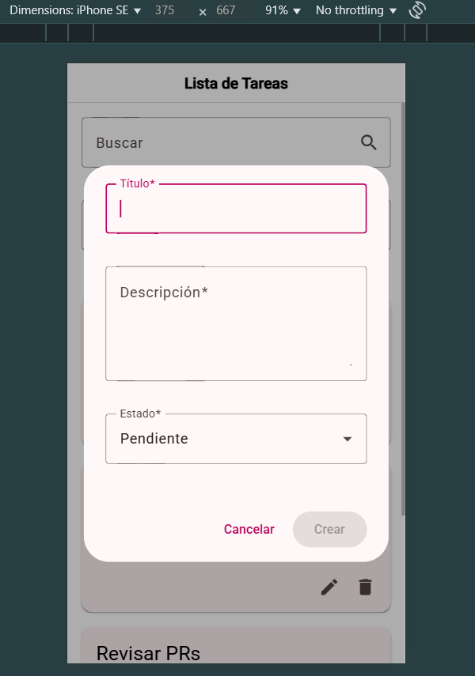

# 📝 Sunbelt ToDo App

Aplicación web desarrollada como prueba técnica para el cargo de **Desarrollador Frontend Junior** en **Sunbelt**.  
Incluye autenticación básica, CRUD de tareas, filtros, uso de Angular Material, soporte para móvil con Ionic y pruebas unitarias.

Nota: Tanto en la version web como la vesion movil los botones estan, el de Log out(superior izquierda), el de crear tarea (superior derecha)
Pero no se muestran debido a unos estilos, sin embargo si existen y son funcionales

---

## 🚀 Demo en producción

🌐 [Ver aplicación desplegada en Netlify](https://apptodosunbelt.netlify.app/)

Las credenciales de acceso son
Usuario: admin@sunbelt.com
Contraseña: 123456

---

## 🛠️ Tecnologías utilizadas

- ✅ Angular 17
- ✅ Ionic Framework (UI móvil responsiva)
- ✅ Angular Material (componentes UI)
- ✅ TypeScript
- ✅ HTML + SCSS
- ✅ Netlify (despliegue)
- ✅ Jasmine & Karma (pruebas unitarias)

---

## 📂 Estructura del proyecto
```bash
src/
├── app/
│ ├── auth/ # Login y autenticación
│ ├── features/
│ │ └── tasks/
│ │   └── components/ #Componente task-form 
│ │   └── models/     #Modelo del task
│ │   └── pages/      #Pagina de task-list
│ │   └── services/   #Servicio de llamado a la mockAPI  
│ ├── shared/ # Módulos y componentes compartidos
│ └── app.component.* # Entrada principal
```

---

## ✅ Funcionalidades implementadas

- ✔️ Login simulado (auth local con LocalStorage)
- ✔️ Botón de logout y protección de rutas
- ✔️ Listado de tareas con filtros por estado y búsqueda
- ✔️ Crear, editar y eliminar tareas
- ✔️ Diseño responsivo compatible con móvil (Ionic)
- ✔️ Pruebas unitarias en componentes y servicios

---

## 🔐 Autenticación

La autenticación es básica (solo frontend), usando LocalStorage para simular una sesión.  
Al iniciar sesión se redirige a `/tasks`, al cerrar sesión se limpia el estado y vuelve al login.

---

## 📦 Instalación y ejecución local

```bash
# Clonar el repositorio
git clone https://github.com/tuusuario/sunbelt-todo-app.git
cd sunbelt-todo-app

# Instalar dependencias
npm install

# Ejecutar en desarrollo
ng serve
```
Correra en el puerto http://localhost:4200

---

###  Iniciar JSON Server

Este proyecto utiliza [`json-server`]para simular una API RESTful. Ya que el JSONPlaceholder no me permite hacer visibles los cambios en las tareas que traia por defecto, simulaba la respuesta, pero no se hacia efectiva, por eso opte por usar un json server 
El archivo `db.json` contiene los datos de las tareas.

En una **consola separada**, ejecuta:

```bash
json-server --watch db.json --port 3000
```
---

###  Iniciar Tests
Correr en la consola el comando 

```bash
ng test
```
---
## 📱 Vista en dispositivo móvil

### Inicio de sesion



### Lista de tareas



### Creacion/edicion de tareas


